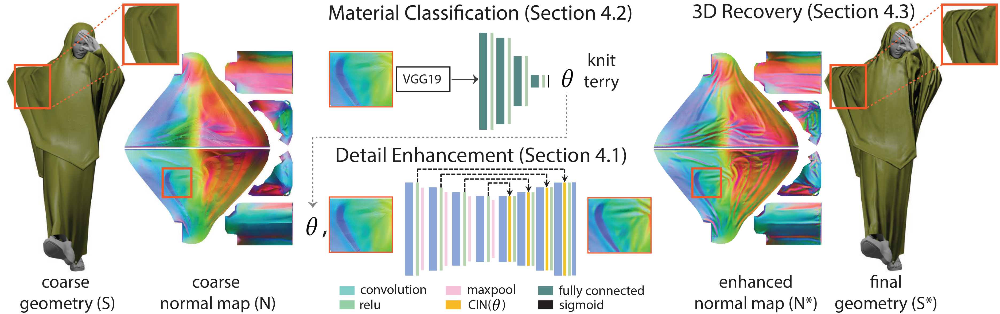

# Deep-Detail-Enhancement-for-Any-Garment

## Introduction
This repository contains the implementation of [Deep Detail Enhancment for Any Garment](http://geometry.cs.ucl.ac.uk/projects/2021/DeepDetailEnhance/) proposed in Eurographics 2021

Ref. to [http://geometry.cs.ucl.ac.uk/projects/2021/DeepDetailEnhance/paper_docs/DeepDetailEnhance.pdf]

We provide Google drive links for downloading the training data, the network checkpoint and two multi-layer garment models (Marvelouse Desigener):
>[Training data](https://drive.google.com/drive/folders/1-rX-g4rSbR8DwKpYJ0IUTKBL3l6hS1qz?usp=sharing)  
>[Checkpoint](https://drive.google.com/drive/folders/1NvJJDQ_ZtKsq107zjMmsnYuH8agYnl8y?usp=sharing)  
>[MD Model](https://drive.google.com/drive/folders/10pFbIgaIkDIUMhvqpTtFboeCa7rUv6ve?usp=sharing)

## ./network_train_and_run
This folder contains the pytorch implemetation of deep detail enhancement network and the material classifier. In order to generalize our approach across different 2D parameterizations, we adopt a patch-based approach. Instead of operating with complete normal maps, we use patches cut from the normal maps as input and output of our network. If you want to retrain the DDE_model, please first run "PatchPrepare.py" on the complete normal maps to generate random cropped patches as training data.

## ./geo_prepare and ./utils
This folder contains code to alginment different resolution garment geometries. The C++ code in ./geo_prepare depends on the library of OpenCV and embree.

## Citation
If you use our code or model, please cite our paper:

  @article{zhang2020deep,
     title={Deep Detail Enhancement for Any Garment},
    author={Zhang, Meng and Wang, Tuanfeng and Ceylan, Duygu and Mitra, Niloy J},
    journal={arXiv e-prints},
    pages={arXiv--2008},
    year={2020}
  }
